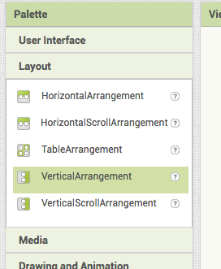
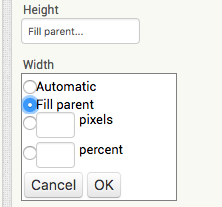
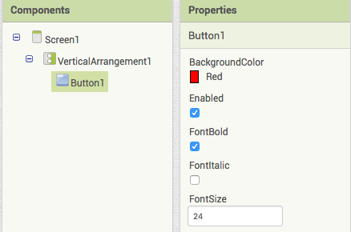
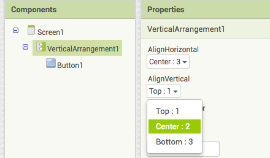

1. Go to App Inventor and select Start a new project from the Projects menu. Give your project a name.
2. In the **Palette** on the left, click **Layout** and drag a **VerticalArrangement** onto the phone screen. 

3. In the **Properties** pane on the right, click on the **Height** property, select **Fill parent** and click **OK**. Do the same for the **Width** property. 

4. Now look in the **Palette** under **User Interface** and drag a **Button** onto your **VerticalArrangement** on the phone screen.

6. Click on *Button1* under **Components** or click on the button itself. In the Properties for *Button1* change the **BackgroundColor** to *Red* and the FontSize to 24. Tick the FontBold checkbox as well.

7. Scroll down and change the **Text** property of *Button1* to "Do not press".
8. Click on the **Height** property and select *pixels*. Type *150* into the box and click **OK**. Then do the same for the **Width**.
9. Finally, find the **Shape** property and select *oval*.
5. Over on the right, under **Components**, click on the *VerticalArrangement1* component. In the **Properties** pane, change the **AlignHorizontal** and **AlignVertical** both to *Center*. Do you see the button move to the middle of the phone screen?

